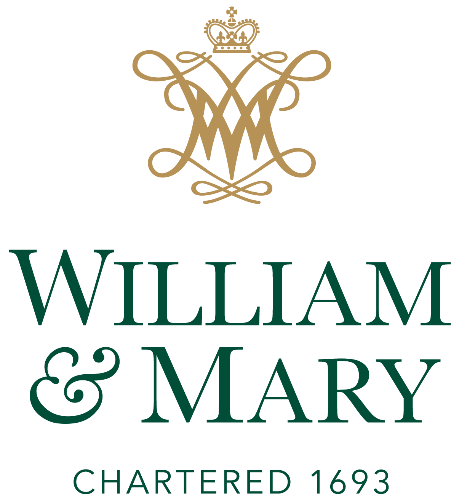

# W&M DATA 340 3 Natural Language Processing, Spring 2023 Syllabus

[Schedule](#Schedule) | [Email Instructor](mailto:jmtucker02@wm.edu)

## Course overview:

This course is designed to introduce students to Natural Language Processing (NLP) and its applications in academic research, data science, and industry. Students will learn how to use natural language processing techniques to gain a deeper understanding of a research question and/or topic. 

## Course venue and time

* Integrated Science Center, room 1111. Tuesdays (T) and Thursdays (Th) 5:00 - 6:20
* Discord: https://discord.gg/rwy2QpZU

## Instructor contact and office hours

* email: jmtucker02@wm.edu or james.tucker@lexicalintelligence.com
* website: https://jamesmtucker.com
* Office hours by appointment only

## Programming language

This course is language agnostic. You can submit your homework and project in whatever programming language you prefer. In class lectures, we will use Python or R for the most part.

## Course objectives:

* Understand the basics of natural language processing techniques and how they can be used to build programs that model human use of language and generate human language.
* Learn how to use natural language processing tools and libraries to perform tasks such as text classification, sentiment analysis, and text generation.
* Develop the ability and experience to design and implement natural language processing systems for real-world applications
* Explore ethical and social implications of natural language processing and artificial intelligence

## Course topics:

1.  Introduction to natural language processing
2.  Data set creation and documentation
3.  Text preprocessing and cleaning
4.  Text classification and sentiment analysis
5.  Neural Networks, Transformers, Large Language Models
6.  Ethical and social implications of natural language processing and artificial intelligence

## Textbook

### Required

* Jurafsky, Dan and James H. Martin. _Speech and Language Processing: An Introduction to Natural Language Processing, Computational Linguistics, and Speech Recognition_. Online: https://web.stanford.edu/~jurafsky/slp3/. [PDF](https://web.stanford.edu/~jurafsky/slp3/ed3book_jan72023.pdf)

### Recommended

* Arcila Calderon, Carlos, et al. _Computational Analysis of Communication_. United Kingdom, Wiley, 2022. [Google Books](https://www.google.com/books/edition/Computational_Analysis_of_Communication/0thjEAAAQBAJ?hl=en&gbpv=0)
* Tunstall, Lewis, Leandro von Werra, and Thomas Wolf. _Natural Language Processing with Transformers_ O'Reilly Media, 2022. [Google Books](https://www.google.com/books/edition/Natural_Language_Processing_with_Transfo/nTxbEAAAQBAJ?hl=en&gbpv=0) 

## Assignments

All assignments are posted cross posted on the [Discord channel](https://discord.gg/rwy2QpZU) and [GitHub Repo](https://github.com/JamesMTucker/DATA_340_NLP).

* Coding assignments (35%) - these are smaller bi-weekly assignments. These assignments reinforce the ideas discussed in lecture or the assigned reading.
* Project (50%) - The student will develop a project related to their area of interest and use NLP techniques to explore a data set in consideration with some research questions.
    * Project milestones (40% of the 50) - these are milestones in the overall development of the project. It is expected that the student will create a GitHub repo to host their code and documentation.
    * Project presentation (10% of the 50) - In the final class sessions, each student will present a short presentation of their projects.
* Course preparation (15%) - It is expected that the student will come to class with having read the assigned readings and/or other additional code documentation.
* See below for extra-credit opportunities

## Schedule

| Date      | Topic                                                                | Assignments                       | Reading                                   | Project Milestones                  | Notebooks |
| --------- | -------------------------------------------------------------------- | --------------------------------- | ----------------------------------------- | ----------------------------------- | --------- |
| Th Jan 26 | Introductions & Syllabus                                             |                                   |                                           |                                     | [Link](https://colab.research.google.com/drive/1KZ4EWcDdnglUuxSr1E5ZOo-ZWlGs8ciD#scrollTo=i7XHXeIEhnlT) |
| T Jan 31  | Natural Language Processing, Data Science, and Large Language Models | Join discord                      |                                           |                                     | [Link](https://colab.research.google.com/drive/1zl8GJOqONP7eEi1YBY0fNZhEDqU45uVW?usp=share_link) |
| Th Feb 02 | Linguistic background & properties of language                       |                                   | [Manning and Schütze](/course_readings/Manning_Schutze_121-156.pdf)             | [Research interest](../project_milestones/01_Research_Interest.md) |  |
| T Feb 07  | Statistics and Information theory                                    |                                   | [Shannon](https://people.math.harvard.edu/~ctm/home/text/others/shannon/entropy/entropy.pdf) (optional)|  | [Link](../Notebooks/Lecture_04_2023_02_07.ipynb) |
| Th Feb 09 | GitHub, Jupyter Notebooks, R Markdown, Code documentation            |          |                                           |                                     | [Link](../Notebooks/Lecture_05_2023_02_09.ipynb) |
| T Feb 14  | Data set creation: Regular Expressions & Web scraping                | [ChatGPT Linguistics essay](../assignment_descriptions/02_ChatGPT.md)                                  | [Grimmer et al.](../course_readings/Grimmer-Grimmer_48-62.pdf); [Jurafsky & Martin 2](/course_readings/Jurafsky_Martin_chapter_2_12-38.pdf) | | |
| Th Feb 16 | Data set creation: Web scraping, APIs, & Social media                | ~Notebook essentials~               | [van Atteveldt et al. 6](https://cssbook.net/chapter12.html)                    |  [GitHub repo README.md](../project_milestones/02_GitHub_Repo_README.md) |  |
| T Feb 21  | Text normalization: lexicons and syntax                              |                                   | [Jurafsky & Martin 2](/course_readings/Jurafsky_Martin_chapter_2_12-38.pdf)     | | |
| Th Feb 23 | Text normalization: tokens, sentences, discourse units               | [Web scraper](../assignment_descriptions/04_Scraper.md)                       | [Jurafsky & Martin 2](/course_readings/Jurafsky_Martin_chapter_2_12-38.pdf) | | |
| T Feb 28  | N-gram language models                                               |                                   | [Jurafsky & Martin 3](/course_readings/Jurafsky_Martin_chapter_3_39-65.pdf)     |           | |
| Th Mar 02 | Naive Bayes classification I                                         | [Exploratory Data Analysis & NLP](../assignment_descriptions/05_EDA.md)   | [Jurafsky & Martin 4](/course_readings/Jurafsky_Martin_chapter_4_66-86.pdf) Recommended: [van Atteveldt et al. 7](https://cssbook.net/chapter12.html) | | |
| T Mar 07  | Naive Bayes classification II                                        |                                   | [Jurafsky & Martin 4](/course_readings/Jurafsky_Martin_chapter_4_66-86.pdf)     | | |
| Th Mar 09 | Evaluating language models                                           | [Naive Bayes](../assignment_notebooks/Naive_Bayes.ipynb) | [Jurafsky & Martin 4](/course_readings/Jurafsky_Martin_chapter_4_66-86.pdf)     | [Data set creation & documentation](/project_milestones/03_Dataset_Creation.md) | |
| T Mar 14  | No class - Spring break                                              |                                   |                                           |                                     | |
| Th Mar 16 | No class - Spring break                                              |                                   |                                           |                                     | |
| T Mar 21  | Logistic regression models I/II                                      |                                   | [Jurafsky & Martin 5](/course_readings/Jurafsky_Martin_chapter_5_87-110.pdf)    | Data set normalization and analysis | |
| Th Mar 23 | Neural Networks (Perceptron, Weights, & Biases)                      |                                   | [Jurafsky & Martin 5](/course_readings/Jurafsky_Martin_chapter_5_87-110.pdf)    |  | |
| T Mar 28  | Vector semantics I (Static & contextualized vectors)                 |                                   | [Jurafsky & Martin 6](/course_readings/Jurafsky_Martin_chapter_6_111-141.pdf)   | Revise code & docs           | |
| Th Mar 30 | Vector semantics II (Similarity & Weighting)                         | [Logistic regression](../assignment_descriptions/07_Logistic_Regression.md)  | [Jurafsky & Martin 6](/course_readings/Jurafsky_Martin_chapter_6_111-141.pdf)   |           | |
| T Apr 04  | Vector semantics III (PCA, t-SNE, & UMAP)                            |                                   | [Jurafsky & Martin 7](/course_readings/Jurafsky_Martin_chapter_7_142-167.pdf); Kinsley et al. |  | |
| Th Apr 06 | Recurrent Neural Networks (RNN) and Long-Short Term Memory (LSTM)    |                                   | [Jurafsky & Martin 8](/course_readings/Jurafsky_Martin_chapter_8_168-192.pdf/) & [9](/course_readings/Jurafsky_Martin_chapter_9_193-218.pdf) | Embeddings of data set | |
| T Apr 11  | Recurrent Neural Networks (RNN) and Long-Short Term Memory (LSTM)    | Word embeddings                   | [Jurafsky & Martin 10](/course_readings/Jurafsky_Martin_chapter_10_219-235.pdf) |           | |
| Th Apr 13 | Introduction to Transformers                                         |                                   | [Jurafsky & Martin 11](/course_readings/Jurafsky_Martin_chapter_11_236-251.pdf) | Red team two classmates projects    | |
| T Apr 18  | Transformers: 'Attention is all you need'                            |                                   | Tunstall et al.                           |                                     | |
| Th Apr 20 | Applied NLP: Named Entity Recognition & Ontologies                   |                                   | Tunstall et al.                           |                                     | |
| T Apr 25  | Applied NLP: Text generation                                         |                                   |                                           |                                     | |
| Th Apr 27 | Project presentations                                                |                                   |                                           |                                     | |
| T May 02  | Project presentations                                                |                                   |                                           |                                     | |
| Th May 04 | Project presentations                                                |                                   |                                           |                                     | |
| T May 09  | Final exams                                                          |                                   |                                           |                                     | |
| Th May 11 | Final exams                                                          |                                   |                                           |                                     | |
| T May 16  | Final exams                                                          |                                   |                                           | Final project due                   | |

## Course policies

Please read and take notice of the following:

### Grade scale

|  | Mark |  | Mark |
| --- | --- | --- | --- |
| 93 - 100 | A | 73 - 76 | C |
| 90 - 92 | A- | 70 - 72 | C- |
| 87 - 89 | B+ | 67 - 69 | D+ |
| 83 - 86 | B | 63 - 66 | D |
| 80 - 82 | B- | 60 - 62 | D- |
| 77 - 79 | C+ | 00 - 59 | F |

### Grading appeals

To appeal a grade, schedule a meeting to discuss it with me.

### Communications

The [discord channel](https://discord.gg/rwy2QpZU) provides an additional way to collaborate with our Natural Language Processing community. You are highly encouraged to participate in discussions on the discord channel. If you ask for help, please provide code examples so that the community can better help and understand.

The course readings, data sets, and code are available on the course [GitHub repo](https://github.com/JamesMTucker/DATA_340_NLP).

### Lecture notebooks

For each lecture, I will share a Google Colaboratory notebook with you. You are welcome to ask questions during the lecture, but you are also encouraged to use the notebook to submit questions during or after the lecture. 

### Absences

If you are absent please email me and let me know or send me a text message. Course work is due as detailed in the course schedule. Late work is penalized 2% of the earned mark for every day it is late. If you are absent on a day that an assignment or project milestone is due, please make sure to turn it in early. If you are ill, please communicate with me regarding an extension.

### Extra-credit

Throughout the semester, I will post at least 10 NLP related coding challenges to the discord channel. You can earn an extra point for every assignment by submitting code that provides a correct answer along with a short description of your thought process and how you came to your solution.

### Mental Well-Being

William & Mary recognizes that students juggle different responsibilities and can face challenges that make learning difficult. There are many resources available at W&M to help students navigate emotional/psychological, physical/medical, material/accessibility concerns, including:  

* The W&M Counseling Center at (757) 221-3620.  Services are free and confidential.  
* The W&M Health Center at (757) 221-4386.  
* For additional support or resources & questions, Contact the Dean of Students at 757-221-2510. 

### Important dates

* Add/drop deadline: Feb. 3
* Midterm grading period: March 6 – 26
* Spring break: March 11 – 19
* Withdraw deadline: March 27
* Advising period: March 20 – 31
* Last day of class: May 5
* Final Exams: May 8 – 12, 15 – 16
* Commencement: May 18 – 20

### Spring 2023 academic calendar

* [PDF](https://www.wm.edu/offices/registrar/documents/calendars/cal22-23.pdf)

### W&M honor code

Students are expected to conduct themselves according to the [Honor Code](https://www.wm.edu/offices/deanofstudents/services/communityvalues/studenthandbook/honor_system/index.php).
