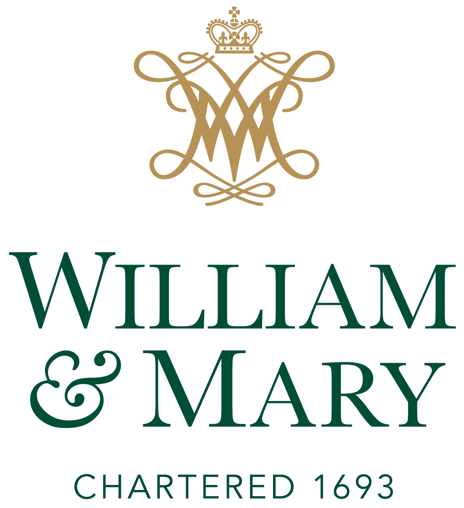

# W&M DATA 340 4 Natural Language Processing, Spring 2024 Syllabus

[Schedule](#Schedule) | [Email Instructor](mailto:jmtucker02@wm.edu)

## Course overview

This course is designed to introduce students to Natural Language Processing (NLP) and its applications in academic research, data science, and industry. Students will learn how to use natural language processing techniques to gain a deeper understanding of a research question and/or topic.

## Course venue and time

- Integrated Science Center, room 1280. Tuesdays (T) and Thursdays (Th) 5:00 - 6:20
- See course in Blackboard

## Instructor contact and office hours

- email: jmtucker02@wm.edu
- website: https://jamesmtucker.com
- Office hours by appointment only

## Programming language

This course is language agnostic. You can submit your homework and project in whatever programming language you prefer. In class lectures, we will use Python, R, or Mojo for the most part.

## Course objectives

- Understand the basics of natural language processing techniques and how they can be used to in data driven decision models
- Learn how to use natural language processing tools and libraries to perform tasks such as text classification, sentiment analysis, and text generation
- Develop the ability and experience to design and implement natural language processing systems for real-world applications
- Explore ethical and social implications of natural language processing and artificial intelligence

## Course topics

1. Introduction to natural language processing
2. Data set creation and documentation
3. Text preprocessing and cleaning
4. Text classification and sentiment analysis
5. Neural Networks, Transformers, Large Language Models
6. Ethical and social implications of natural language processing and artificial intelligence

## Textbook

### Required

- Jurafsky, Dan and James H. Martin. _Speech and Language Processing: An Introduction to Natural Language Processing, Computational Linguistics, and Speech Recognition_. Online: https://web.stanford.edu/~jurafsky/slp3/. [PDF](https://web.stanford.edu/~jurafsky/slp3/ed3book_jan72023.pdf)

### Recommended

- Arcila Calderon, Carlos, et al. _Computational Analysis of Communication_. United Kingdom, Wiley, 2022. [Google Books](https://www.google.com/books/edition/Computational_Analysis_of_Communication/0thjEAAAQBAJ?hl=en&gbpv=0)
- Tunstall, Lewis, Leandro von Werra, and Thomas Wolf. _Natural Language Processing with Transformers_ O'Reilly Media, 2022. [Google Books](https://www.google.com/books/edition/Natural_Language_Processing_with_Transfo/nTxbEAAAQBAJ?hl=en&gbpv=0)

## Assignments

There are a possible 150 points to earn in this course.

All assignments are posted [GitHub Repo](https://github.com/JamesMTucker/DATA_340_NLP) and links are provided in Blackboard.

- Understanding NLP (10pts) - A conversation with ChatGPT about Linguistics, NLP, and Data Science
- NLP Problem sets (100pts) - these assignments are designed to reinforce the ideas discussed in lecture or the assigned reading. Whereas the student can expect to solve the problem sets from the topics covered in lecture, it is encouraged that the student explore additional solutions and creative thinking.
  
  - Problem set 0: Exploratory Data Analysis in a NLP context - Distributions and Features
  - Problem set 1: Semantic Search Engine - king is to queen as man is to ?
  - Problem set 2: Author prediction - Federalist Papers
  - Problem set 3: Clustering news articles - Retrieval augmented generation (RAG)
  - Problem set 4: Fine-tuning a LLM on prompt engineering
  
- Final Exam (40pts) - Demonstrate your mastery of NLP concepts

## Schedule

## Course policies

Please read and take notice of the following:

### Grade scale

|          | Mark |         | Mark |
| -------- | ---- | ------- | ---- |
| 93 - 100 | A    | 73 - 76 | C    |
| 90 - 92  | A-   | 70 - 72 | C-   |
| 87 - 89  | B+   | 67 - 69 | D+   |
| 83 - 86  | B    | 63 - 66 | D    |
| 80 - 82  | B-   | 60 - 62 | D-   |
| 77 - 79  | C+   | 00 - 59 | F    |

### Grading appeals

To appeal a grade, schedule a meeting to discuss it with me.

### Communications

Course announcements will be posted in Blackboard. Please check Blackboard regularly for announcements.

The course readings, data sets, and code are available on the course [GitHub repo](https://github.com/JamesMTucker/DATA_340_NLP).

### Absences

If you are absent please email me and let me know or send me a text message. Course work is due as detailed in the course schedule. Late work is penalized 2% of the earned mark for every day it is late. If you are absent on a day that an assignment or project milestone is due, please make sure to turn it in early. If you are ill, please communicate with me regarding an extension.

### Mental Well-Being

William & Mary recognizes that students juggle different responsibilities and can face challenges that make learning difficult. There are many resources available at W&M to help students navigate emotional/psychological, physical/medical, material/accessibility concerns, including:

- The W&M Counseling Center at (757) 221-3620. Services are free and confidential.
- The W&M Health Center at (757) 221-4386.
- For additional support or resources & questions, Contact the Dean of Students at 757-221-2510.

### Important dates

- [Web](https://www.wm.edu/offices/registrar/calendarsandexams/ugcalendars)

### W&M honor code

Students are expected to conduct themselves according to the [Honor Code](https://www.wm.edu/offices/deanofstudents/services/communityvalues/studenthandbook/honor_system/index.php).
